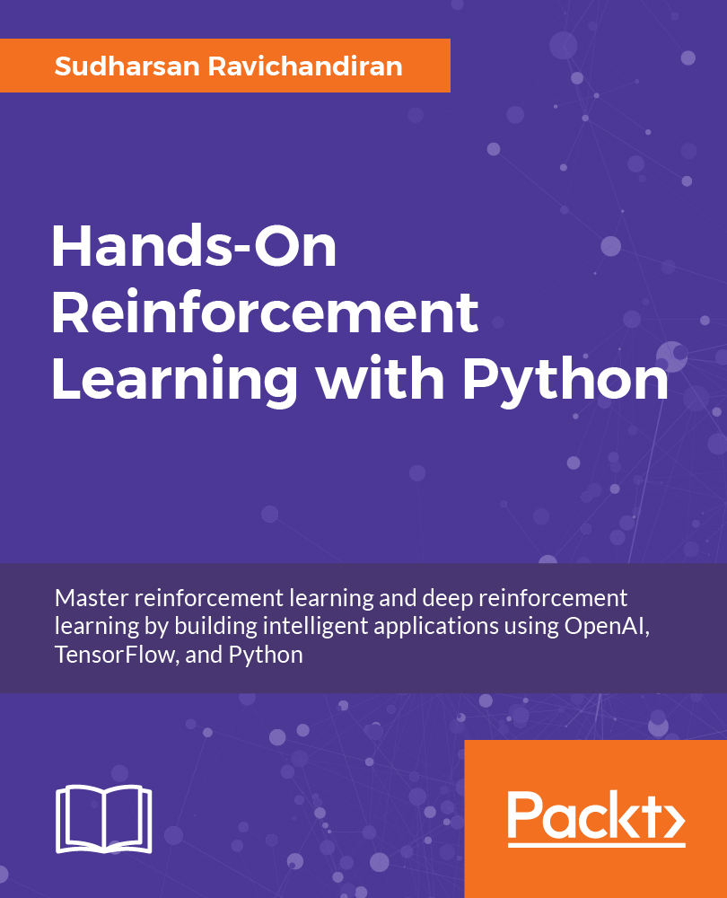

# Hands On Reinforcement Learning With Python

Master reinforcement learning and deep reinforcement learning by building intelligent applications using OpenAI, TensorFlow, and Python

# About the Book

Reinforcement Learning with Python will take your learning to the next level. It will help you master the concepts of reinforcement learning to deep reinforcement learning. The book will explain everything from scratch by implementing practical applications at work or projects, all written in Python.

The book starts with an introduction to Reinforcement Learning, OpenAI, and TensorFlow. You will then explore Reinforcement learning algorithms and concepts. 

This example-rich guide will introduce you to neural networks and deep learning, covering various deep learning algorithms. You will explore deep reinforcement learning in depth, which is a combination of deep learning and reinforcement learning. You will also learn how deep reinforcement learning algorithms can be used with TensorFlow and Keras to build intelligent applications.

 

# Get the Book

 

